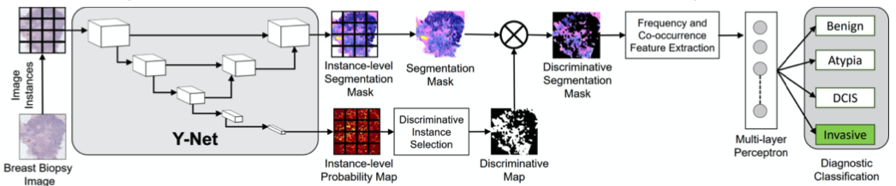
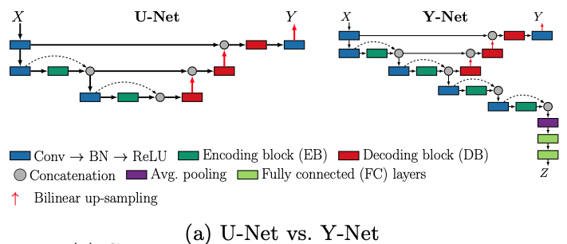
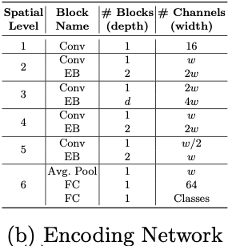
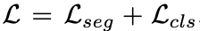

# Y-Net: Joint Segmentation and Classification for Diagnosis of Breast Biopsy Images
## Abstract
* Y-NetはU-Netに識別マップを生成するための並列なパスを追加し、かつConvブロックのモジュラー性をサポートしている
* Y-Netは6.6倍少ないパラメーター数でSoTAを達成した
* セグメンテーションマップを使った分類により、診断分類においてSoTAよりも7%高い精度を達成した

## Introduction
* SegmentationとClassificationを組み合わせた、Y-Netという組織レベルのセグメンテーションマスクとsaliencyマップを同時に生成できるネットワークを紹介する
* 本研究のゴールはROI画像を入力して、同時にセグメンテーションと分類を行い、診断を出力するシステムの構築である
* 本研究の主な貢献は、上記２つを連結して学習する方法である
* 本研究では大きな1枚の画像ごとに診断結果のラベルが付与される。そのため各ROIそれぞれには別個にクラスは設定されておらず、本システムは診断への寄与度を学習することとなる

## 2. A System for Joint Segmentation and Classification
* Y-Netはinstance-levelのセグメンテーションマスクと、それぞれのインスタンスに対して、8種の組織タイプのpredicted labelsの2つを出力する
* これらの2つの出力はROI全体のセグメンテーションマスクを生成するために結合される
* Instance-levelの確率マップは4つの診断カテゴリのうちの一つに該当する確率の最大値が含まれる？
* 2値化した上記マップとSegmentation maskを掛け合わせ、discriminativeなセグメンテーションマスクを生成する（不必要な箇所を落としたセグメンテーションマスク）

### 2.1 Y-Net Architecture
#### Y-Net
* Y-Netは2ステージ処理となっている:
* 1st stageはinstance-levelセグメンテーションマスクをU-Net同様に生成する
* 2nd stageは追加された並列パスからinstance-level classification labelを生成する

#### Abstract representation of encoding and decoding blocks:
* U-Netではencoder／decoderどちらもそれぞれ同じconvolutionalブロックを積み重ねて
* Y-Netではこの表現を抽象化し、convolutionalブロックをencode/decodeの一般的なブロックとして表現し、各深さで同じブロックを使うことを強制されないようにした（意味は分かるが実際が不明

#### その他の工夫
* 2つのハイパーパラメーターを採用し、モデルの大きさを簡単に変えられるようにした (width multipier: w, depth-multiplier: d)
* U-Netのskip-connectionはencoding->decodingの同じステージだけだったのに対し、Y-Netではステージごとに最初のencodingブロックから最後のencodingブロックへのskip-connectionを追加した（segmentationの改善のため
* 学習時はまずY-Netをセグメンテーション向けに学習し、その後にspatial level4以降を追加し、segmentationとclassificationを学習した
* Loss functionはで、Lseg, Lclsはどちらも”multi-nominal” crossEntropy Loss function

### 2.2 Discriminative Instance Selection
* Y-Netの出力zは各診断分類に対応しておりSoftmaxで正規化される
* もしmax(z)>Γの場合には診断に寄与しているとみなすことができる (Γは[ここを参照](https://arxiv.org/pdf/1504.07947.pdf)）

### 2.3 Diagnostic Classification

## その他
* 実装上、stage1はただのsemantic segmentation
